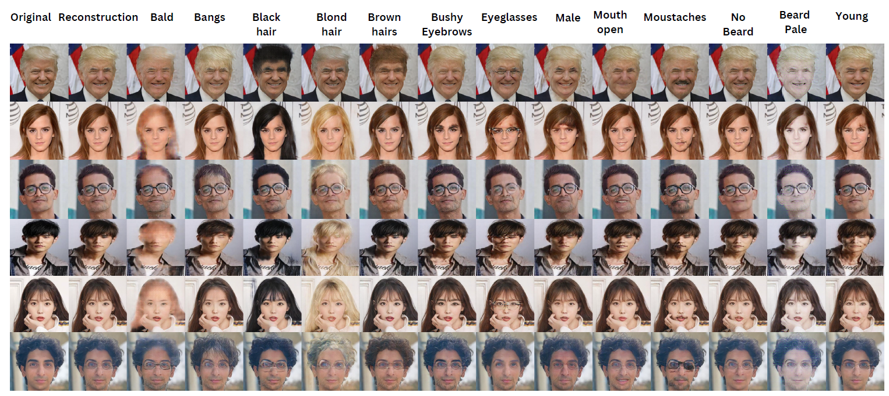
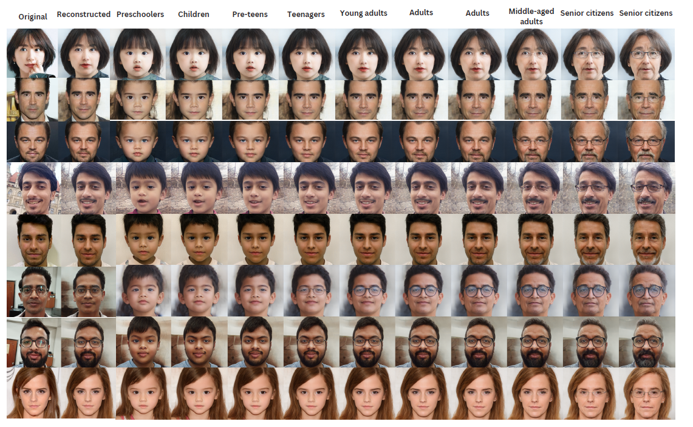

# FYP-Stable

# Table Of Contents
1. **[Face Detection](#1-face-detection)**
2. **[Face Recognition](#2-face-recognition)**
3. **[Multiple Face Recognition Using Multiple Cameras](#3-multiple-face-recognition-using-multiple-cameras)**
4. **[Batch Face Recognition Using Single Camera](#4-batch-face-recognition-using-single-camera)**
5. **[Generative AI](#5-generative-ai)** 

# Introduction

# 1. Face Detection
Various libraries were employed for face detection, including **OpenCV** and **Dlib**. However, **YOLOv8 exhibited superior performance** compared to its counterparts. The results are delineated below.
## Results
<table>
    <td>
      <figure>
        
        <figcaption>&nbsp;&nbsp;&nbsp;&nbsp;&nbsp;&nbsp;&nbsp;&nbsp;&nbsp;&nbsp;&nbsp;Guide For Confusion Matrix</figcaption>
      </figure>
    </td>
    <td>
      <figure>
       
        <figcaption>&nbsp;&nbsp;&nbsp;&nbsp;&nbsp;&nbsp;&nbsp;&nbsp;&nbsp;&nbsp;&nbsp;&nbsp;&nbsp;&nbsp;Confusion Matrix</figcaption>
      </figure>
    </td>
  </tr>
</table>

<table>
    <td>
      <figure>
        
        <figcaption>&nbsp;&nbsp;&nbsp;&nbsp;&nbsp;&nbsp;&nbsp;&nbsp;&nbsp;&nbsp;&nbsp;Evaluation Metrics</figcaption>
      </figure>
    </td>
    <td>
      <figure>
       
        <figcaption>&nbsp;&nbsp;&nbsp;&nbsp;&nbsp;&nbsp;&nbsp;&nbsp;&nbsp;&nbsp;&nbsp;&nbsp;&nbsp;&nbsp;Real-Time Detection</figcaption>
      </figure>
    </td>
  </tr>
</table>

# 2. Face Recognition
There are three main components to this project.
- **Server Side:** Website for adding registered students/employees to the database
- **Client side:** TestBed (Hardware) for visual feedback of the attendance
- **Client side:** Face Recognition

## Simplified Methodology

## Server Side: Website
The website is made using MERN stack (Mongodb, Express, React and NodeJs). The key functionalities of the website are
1. Admin Authentication
2. Dashboard UI to show all the registered Students
3. Supports Registering, Modification and Deletion of Students in the Database

<table>
    <td>
      <figure>
        
        <figcaption>&nbsp;&nbsp;&nbsp;&nbsp;&nbsp;&nbsp;&nbsp;&nbsp;&nbsp;&nbsp;&nbsp;Guide For Website</figcaption>
      </figure>
    </td>
    <td>
      <figure>
       
        <figcaption>&nbsp;&nbsp;&nbsp;&nbsp;&nbsp;&nbsp;&nbsp;&nbsp;&nbsp;&nbsp;&nbsp;&nbsp;&nbsp;&nbsp;Frontend and Database</figcaption>
      </figure>
    </td>
  </tr>
</table>

## Client Side: Hardware Implemnetation
Three designated lanes will be provided for users to mark their attendance via camera recognition. Each gate will be equipped with a camera positioned overhead, which will facilitate the attendance marking process for a single student at a time. The camera will capture an image/frame of the user, initiate face detection algorithm, Create facial encodings using face recognition, cross-reference these against registered encodings stored in the database, and subsequently retrieve the pertinent information. Upon successful identification, the LED indicator will illuminate green.

The implementation utilizes the `pyfirmata` library to interface with the LED indicator on the Arduino board.

## Client Side: Face Recognition
The face recognition functionality underwent rigorous testing utilizing two prominent libraries: **DeepFace** and **FaceRecognition**. Following thorough evaluation, **FaceRecognition emerged as the superior performer**, showcasing optimal performance compared to DeepFace.

## Results
<table>
    <td>
      <figure>
        
         <figcaption>&nbsp;&nbsp;&nbsp;&nbsp;&nbsp;&nbsp;&nbsp;&nbsp;&nbsp;&nbsp;&nbsp;&nbsp;&nbsp;&nbsp;Confusion Matrix</figcaption>
      </figure>
    </td>
    <td>
      <figure>
       
        <figcaption>&nbsp;&nbsp;&nbsp;&nbsp;&nbsp;&nbsp;&nbsp;&nbsp;&nbsp;&nbsp;&nbsp;&nbsp;&nbsp;&nbsp;Inference Time(seconds)</figcaption>
      </figure>
    </td>
  </tr>
</table>

## User Interface

# 3. Multiple Face Recognition Using Multiple Cameras
Face recognition will be conducted using multiple cameras, with each camera focusing on a single student or employee within its field of view. This system employs multiprocessing, ensuring that each camera instance operates independently of others. Each instance is executed as a separate process, initiated by running the file multiple times in different terminals, specified by 

`python main.py (name of Camera Instance)`. 

This approach enhances efficiency and scalability by enabling concurrent processing of multiple camera feeds without interference between instances.

## Results
The inference time for each of the camera along with the retrieval time of the infromation from the database.

# 4. Batch Face Recognition Using Single Camera
Face recognition will be conducted using a single camera which will capture the faces of the students in a bulk. We have optimized the code by improving the performance of the face recognition by reducing the false positive rate and also by adding an LRU cache to reduce the retrieval time to fetch the records from the database.

## Results
The results have been compiled for 2 students concurrently being shown in the frame.
<table>
    <td>
      <figure>
        
        <figcaption>&nbsp;&nbsp;&nbsp;&nbsp;&nbsp;&nbsp;&nbsp;&nbsp;&nbsp;&nbsp;&nbsp;Batch Recognition Results</figcaption>
      </figure>
    </td>
    <td>
      <figure>
       
        <figcaption>&nbsp;&nbsp;&nbsp;&nbsp;&nbsp;&nbsp;&nbsp;&nbsp;&nbsp;&nbsp;&nbsp;&nbsp;&nbsp;&nbsp;LRU And UI Optimizations</figcaption>
      </figure>
    </td>
  </tr>
</table>

<table>
    <td>
      <figure>
        
        <figcaption>&nbsp;&nbsp;&nbsp;&nbsp;&nbsp;&nbsp;&nbsp;&nbsp;&nbsp;&nbsp;&nbsp;&nbsp;&nbsp;&nbsp;&nbsp;&nbsp;&nbsp;&nbsp;&nbsp;&nbsp;&nbsp;&nbsp;&nbsp;&nbsp;&nbsp;&nbsp;&nbsp;&nbsp;&nbsp;&nbsp;&nbsp;&nbsp;&nbsp;&nbsp;&nbsp;&nbsp;&nbsp;&nbsp;&nbsp;&nbsp;&nbsp;&nbsp;&nbsp;&nbsp;&nbsp;Overall Performance Of Face Recognition</figcaption>
      </figure>
    </td>
  </tr>
</table>

# 5. Generative AI
This was research part of our project where we experimented with 2 different models. **5.1 Attribute Gans for Facial Attributes** and **5.2 Interface Gans for Aging**

## 5.1 Attribute Gans
<table>
    <td>
      <figure>
        
        <figcaption>&nbsp;&nbsp;&nbsp;&nbsp;&nbsp;&nbsp;&nbsp;&nbsp;&nbsp;&nbsp;&nbsp;Tom Cruise</figcaption>
      </figure>
    </td>
    <td>
      <figure>
       
        <figcaption>&nbsp;&nbsp;&nbsp;&nbsp;&nbsp;&nbsp;&nbsp;&nbsp;&nbsp;&nbsp;&nbsp;&nbsp;&nbsp;&nbsp;Donald Trump</figcaption>
      </figure>
    </td>
  </tr>
</table>

## 5.2 Interface Gans
<table>
    <td>
      <figure>
        
        <figcaption>&nbsp;&nbsp;&nbsp;&nbsp;&nbsp;&nbsp;&nbsp;&nbsp;&nbsp;&nbsp;&nbsp;Colin Farrell</figcaption>
      </figure>
    </td>
    <td>
      <figure>
       
        <figcaption>&nbsp;&nbsp;&nbsp;&nbsp;&nbsp;&nbsp;&nbsp;&nbsp;&nbsp;&nbsp;&nbsp;&nbsp;&nbsp;&nbsp;Yiurki</figcaption>
      </figure>
    </td>
  </tr>
</table>

# Tech Stack
<li>Python</li>
<li>OpenCv</li>
<li>Pytorch</li>
<li>Yolov8</li>
<li>React</li>
<li>MongoDB</li>

### Contributors
- **[Muhammad Waleed Gul](https://github.com/waleedgul92)**
- **[Mehwish Sameer](https://github.com/MehwishSameer)**

**© Developed Under the Supervision of** 
- **[Dr Muhammad Rafi](https://khi.nu.edu.pk/personnel/dr-muhammad-rafi-phd/)(Associate Professor –Head of Department of AI & DS)**
- **[Dr Muhammad Waqas](https://khi.nu.edu.pk/personnel/dr-muhammad-waqas-phd/)(Assistant Professor)**
